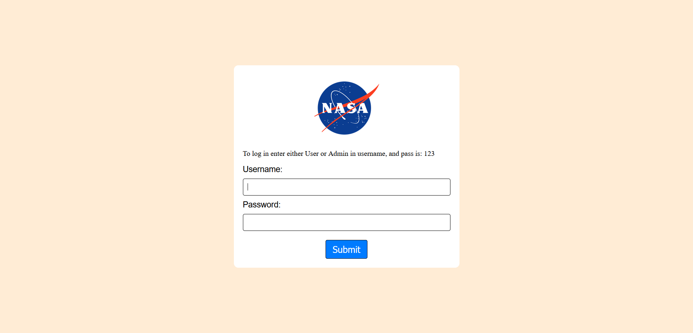

# 🚀 NASA

## Login

To get access to the app's content you will first be asked to log in.

You can log in with the username of Either Admin, or User, and the password is 123.

## Content

After logging in, we are able to see 10 random NASA posts desplayed on the screen under our Navbar.

We are then able to add those posts to our favorites, load more of them, or if we have the admin role, delete them!

To load more posts we can either press Load More at our navbar, or scroll close to the bottom.

# 👉 Built with
* HTML5
* CSS3
* JS

# 💻 Development
1. git clone https://github.com/DanijelAdrinek/nasa-OOP.git
2. run index.html in the browser